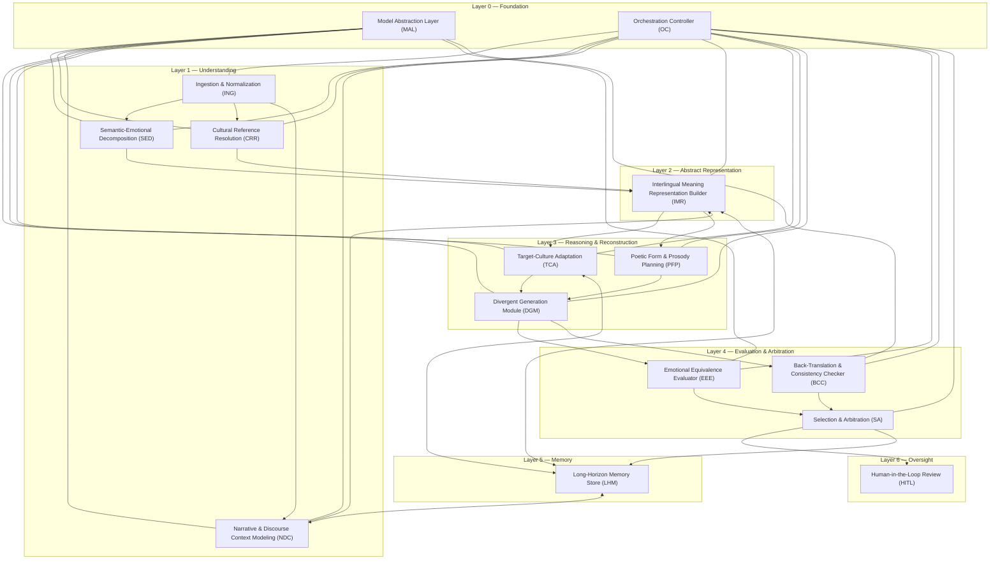

# AURA — Technical Design Document

**Adaptive Understanding & Re-expression Architecture**

Status: Research-grade architecture specification
Scope: System design only — no application code, no APIs, no frontend

---

## 1. Purpose and Design Philosophy

AURA is not a translation engine. A translation engine maps source tokens to
target tokens under a fidelity-to-surface-form objective. AURA's objective is
different and stricter: given an expression in a source language, produce a
target-language expression that a native reader of the target culture would
experience with the **same emotional impact, poetic effect, cultural
resonance, and narrative function** as a native reader of the source
experienced the original — even when this requires departing significantly
from literal meaning.

This is fundamentally a **meaning-preservation and re-authoring problem**,
not a mapping problem. The architecture reflects that by never allowing a
direct source-string → target-string path to exist. Every path from input to
output passes through an intermediate, language-independent representation
of *what the text is doing to a reader*, and every output is the product of
generation, self-critique, and selection — not lookup or substitution.

### 1.1 Governing principles

1. **No direct translation path.** There is no module and no interface in
   this system that accepts source text and emits target text in one step.
   The shortest legal path is: decompose → represent abstractly → re-author →
   evaluate → select.
2. **Model replaceability as a first-class constraint.** Every module that
   depends on a learned model (LLM, embedding model, classifier) is defined
   by a stable *contract* (inputs/outputs/data structures), not by the model
   itself. Any module's backing model must be swappable without changing any
   other module's code, because the assumption driving this design is that
   underlying models will materially improve over the system's lifetime.
3. **Language independence of the core representation.** The system's
   central data structure — the Interlingual Meaning Representation (IMR) —
   has no privileged language. English is not a hidden pivot language. This
   matters because pivoting through a natural language silently reintroduces
   the literal-translation failure mode this system exists to avoid.
4. **Multiplicity before selection.** Because emotional/poetic equivalence is
   underdetermined (many valid re-expressions exist), the system generates
   *populations* of candidates and adjudicates among them, rather than
   committing to a single generation.
5. **Auditability over black-box output.** Every stage's output is a typed,
   inspectable artifact. A human or downstream system can always ask "why did
   AURA choose this rendering" and get a structured answer tracing back
   through IMR, candidate generation, and evaluation scores.
6. **Long-horizon consistency is architected, not incidental.** For anything
   longer than a single utterance (a poem, a scene, a novel), voice, motif,
   and terminology consistency are tracked explicitly in a memory module —
   not left to a model's context window.

### 1.2 Non-goals (explicitly out of scope for this document)

- Real-time/low-latency operation.
- API surface design, transport protocols, storage engine choice.
- UI/UX or any human-facing product surface.
- Any specific model vendor or model family selection.

---

## 2. System Layers and Module Map



**Reading order for this document:** Layer 0 (foundation modules every other
module depends on), then Layers 1–6 in pipeline order. Each module section
follows the same template: Purpose, Inputs, Outputs, Internal Data
Structures, Algorithms, Interfaces, Failure Modes, Future Improvements.

---

## 3. Layer 0 — Foundation Modules

### 3.1 Model Abstraction Layer (MAL)

**Purpose**
Decouple every other module from any specific model provider, version, or
architecture. MAL is the *only* place in the system that knows how to talk
to an actual model (LLM, embedding model, classifier, prosody model, etc.).
Every other module addresses MAL through a capability contract, never a
vendor SDK. This is the mechanism that makes the "assume future models are
better" assumption actionable: upgrading a model means changing a binding in
MAL, not touching the eleven modules that consume it.

**Inputs**
- `CapabilityRequest`: an abstract description of what's needed (e.g.
  `{capability: "emotional-salience-scoring", input: SemanticUnit, budget:
  Latency|Quality}`).
- Model registry configuration (which concrete model backs which
  capability, versioned).

**Outputs**
- `CapabilityResponse`: typed result matching the capability's declared
  output schema, plus provenance metadata (`model_id`, `model_version`,
  `confidence`, `latency_ms`).

**Internal data structures**
- `CapabilityContract`: `{capability_name, input_schema, output_schema,
  invariants}` — the schema is versioned independently of any model.
- `ModelBinding`: `{capability_name -> model_adapter}` mapping, hot-swappable.
- `ModelAdapter` interface: a thin wrapper implementing one contract against
  one concrete model/API.

**Algorithms**
- Capability routing: given a `CapabilityRequest`, select the currently
  bound adapter; supports **ensemble routing** (query N adapters, merge via
  a declared reducer — e.g. majority vote for classification, weighted
  average for scalar scoring) for capabilities where cross-model agreement
  increases reliability (notably EEE scoring, see §6.1).
- Adapter health-checking and automatic fallback to a secondary binding on
  error or SLA breach.
- Shadow evaluation: a newly registered adapter can be run in parallel with
  the production adapter without affecting output, to accumulate comparative
  quality data before promotion.

**Interfaces**
- `invoke(CapabilityRequest) -> CapabilityResponse` (synchronous or
  streaming variant).
- `register_binding(capability_name, model_adapter, policy)`.
- `promote(capability_name, candidate_binding)` — governance action, not
  invoked by pipeline modules.

**Failure modes**
- *Silent capability drift*: a new model version changes output distribution
  in a way that violates a downstream module's implicit assumptions, without
  any schema violation. Mitigated by contract invariants (§ below) and
  shadow evaluation, not eliminated by them.
- *Adapter unavailability*: upstream provider outage. Mitigated by fallback
  bindings; if no fallback exists, the capability request fails closed and
  propagates a typed `CapabilityUnavailable` error rather than degrading
  silently.
- *Schema mismatch on upgrade*: new model returns data that technically
  satisfies the schema but violates an implicit invariant (e.g. confidence
  scores no longer calibrated the same way). Requires invariant tests, not
  just schema tests, at promotion time.

**Future improvements**
- Automatic capability benchmarking harness that scores candidate bindings
  against held-out human-judged data before promotion.
- Cost/quality/latency multi-objective routing instead of single-adapter
  binding.
- Cross-capability model reuse (one very capable multimodal model serving
  several capability contracts) without contract simplification.

---

### 3.2 Orchestration Controller (OC)

**Purpose**
Sequence the pipeline, manage branching (e.g. multiple candidate paths in
Layer 3–4), handle retries and partial failure, and maintain the run-level
audit trail. OC encodes *process*, not *meaning* — it has no opinion about
emotion or culture; it only knows the dependency graph between modules.

**Inputs**
- `PipelineRequest`: source text/document + processing policy (e.g. "poem,
  preserve meter" vs "prose, preserve narrative voice").
- Module outputs (as the pipeline progresses).

**Outputs**
- `PipelineTrace`: ordered log of every module invocation, its inputs,
  outputs, timing, and any retries — the audit trail referenced in
  principle 5 (§1.1).
- Final `RenderResult` (produced by SA, passed through OC).

**Internal data structures**
- `PipelineGraph`: DAG of module stages with declared dependencies (Layer 1
  modules can run in parallel; Layer 2 depends on all of Layer 1; etc.).
- `RunContext`: carries `document_id`, `segment_id` (for long documents split
  into segments — see NDC/LHM), policy flags, and accumulated intermediate
  artifacts.

**Algorithms**
- Topological execution of `PipelineGraph` with parallel dispatch of
  independent stages (SED, CRR, NDC all consume ING's output independently).
- Retry with backoff on transient `CapabilityUnavailable` errors from MAL.
- Circuit-breaking: if a stage fails repeatedly, halt the run and surface a
  structured failure rather than producing a degraded silent output.
- Segment fan-out/fan-in for long documents: split into narrative-coherent
  segments (scene/stanza boundaries, not arbitrary token windows), process
  in parallel, reconcile through LHM at fan-in.

**Interfaces**
- `run(PipelineRequest) -> RenderResult`
- `get_trace(run_id) -> PipelineTrace`
- `resume(run_id, from_stage)` — for expensive long-document runs where a
  late stage fails and re-running Layer 1 is wasteful.

**Failure modes**
- *Partial pipeline failure on long documents*: one segment fails NDC while
  others succeed. Requires a defined partial-success policy (fail the whole
  document vs. flag the segment and continue) — this is a policy decision
  the OC must make explicit, not hide.
- *Segment boundary errors*: naive splitting breaks narrative continuity
  (e.g. splits mid-dialogue), corrupting NDC/LHM context. Mitigated by using
  discourse-aware segmentation (see NDC) rather than fixed-length windows.
- *Non-determinism across retries*: retried stage produces a materially
  different result than the failed attempt, creating an inconsistent trace.
  Mitigated by recording all attempts in `PipelineTrace`, not just the last.

**Future improvements**
- Cost-aware scheduling (skip expensive divergent generation for
  low-ambiguity segments, detected via SED confidence).
- Adaptive segment sizing based on narrative structure detection rather than
  fixed heuristics.

---

## 4. Layer 1 — Understanding Modules

### 4.1 Ingestion & Normalization (ING)

**Purpose**
Convert raw input (plain text, markup, subtitle files, structured
manuscript formats) into a normalized, position-addressable text object
that every downstream module can rely on having the same shape.

**Inputs**
- Raw source document (text, with optional format metadata: verse/prose,
  script/dialogue, subtitle timing).
- Source language tag (declared or to be detected).

**Outputs**
- `NormalizedDocument`: `{segments: [Segment], language, script,
  structural_metadata}`.

**Internal data structures**
- `Segment`: `{id, text, span, type: prose|verse-line|dialogue-turn|stage-direction,
  speaker?: string, position_in_document}`.
- `StructuralMetadata`: stanza/scene/chapter boundaries, rhyme scheme
  annotations if pre-existing (e.g. from a marked-up source), speaker
  turn-taking structure for dialogue-heavy works.

**Algorithms**
- Encoding normalization, script detection, language identification
  (fallback when not declared).
- Structural parsing: detect verse vs. prose, dialogue attribution, stanza
  breaks — using format-specific parsers, not a single generic tokenizer.
- Segment boundary detection tuned to preserve semantically/emotionally
  coherent units (a full sentence, a full verse line, a full turn) rather
  than fixed token windows.

**Interfaces**
- `normalize(raw_input, hints?) -> NormalizedDocument`

**Failure modes**
- *Structural misclassification*: free verse misclassified as prose,
  collapsing line breaks that carry poetic weight (line breaks are
  semantically loaded in poetry). Mitigated by conservative structure
  preservation — when uncertain, preserve more structure, not less.
- *Language misidentification* on code-switched or archaic text.
- *Loss of non-textual signal*: stage directions, emphasis markup, or
  formatting that carries emotional information (e.g. ALL CAPS shouting)
  stripped during normalization instead of being carried forward as
  metadata.

**Future improvements**
- Multimodal ingestion (source with audio performance, e.g. spoken-word
  poetry with prosodic recording) feeding richer emotional cues than text
  alone.

---

### 4.2 Semantic-Emotional Decomposition (SED)

**Purpose**
For each segment, extract *what it literally means* and, separately,
*what it does emotionally* — these are deliberately kept as distinct,
parallel outputs rather than merged, because a later module (TCA) must be
free to trade off literal accuracy against emotional accuracy, and it can
only do that if both are legible independently.

**Inputs**
- `Segment` (from ING), with document-level context window (from NDC, once
  available — SED can run in an initial pass and be refined in a second
  pass after NDC produces broader context).

**Outputs**
- `SemanticUnit`: literal propositional content, per segment.
- `EmotionalProfile`: per segment, a structured multi-dimensional emotional
  reading (not a single sentiment score).

**Internal data structures**
- `SemanticUnit`: `{segment_id, propositions: [Proposition], referents,
  ambiguities: [AmbiguitySpan]}`.
- `EmotionalProfile`: `{segment_id, valence, arousal, dominance,
  discrete_affect_tags: [e.g. grief, longing, defiance], intensity,
  confidence, evidence_spans}`. Dimensional (valence/arousal/dominance) *and*
  categorical tags are both retained — dimensional scores support
  trajectory modeling (§ EEE), categorical tags support human legibility and
  culturally-specific affect categories that don't map cleanly onto
  valence/arousal (e.g. "saudade", "mono no aware").
- `AmbiguitySpan`: marks places where literal meaning is genuinely
  underdetermined (double meanings, puns) — flagged rather than resolved,
  since resolution may be culture-dependent and belongs in TCA.

**Algorithms**
- Model-backed semantic parsing (via MAL capability
  `semantic-decomposition`) producing propositional structure.
- Model-backed affective analysis (via MAL capability
  `affective-profiling`) producing the dimensional + categorical profile.
- Cross-checking: when semantic parse and affective profile disagree in
  valence implied by literal content vs. detected affect (e.g. literally
  positive words used sarcastically), flag as `ironic_marker` rather than
  silently picking one reading.
- Ensemble scoring for `EmotionalProfile` (via MAL's ensemble routing,
  §3.1) since affect judgment benefits more from cross-model agreement than
  a single high-confidence read.

**Interfaces**
- `decompose(segment, context?) -> (SemanticUnit, EmotionalProfile)`

**Failure modes**
- *Flattened irony/sarcasm*: literal-vs-affective mismatch is not detected,
  producing an `EmotionalProfile` that's simply wrong. Partially mitigated
  by the cross-check above; not fully solvable without discourse context
  (NDC) and sometimes not solvable at all without world knowledge outside
  the text.
- *Culturally-specific affect mislabeled onto the nearest Western affect
  category*, losing what's distinctive about it. This is why categorical
  tags are kept open-vocabulary rather than constrained to a fixed taxonomy.
- *Overconfident scoring on ambiguous text*: model reports high confidence
  on a genuinely ambiguous emotional read. Mitigated by requiring evidence
  spans (so confidence can be audited against actual textual support) and
  ensemble disagreement as a confidence signal.

**Future improvements**
- Personalized/character-conditioned affect modeling (the same line means
  different things depending on which character speaks it — ties into NDC).
- Learned, continuously-expanding open-vocabulary affect taxonomy instead of
  a fixed tag set.

---

### 4.3 Cultural Reference Resolution (CRR)

**Purpose**
Identify culturally-loaded elements of the source (idioms, allusions,
symbols, humor, taboo, honorifics, religious/historical references) and
characterize *what cultural work they do* — not what their target-language
equivalent is (that's TCA's job downstream). CRR answers "what is this
doing for a source-culture reader," not "what should replace it."

**Inputs**
- `Segment` + `SemanticUnit` (from SED).
- `CulturalKnowledgeBase` (see LHM/knowledge store, §7).

**Outputs**
- `CulturalReferenceSet`: list of `CulturalReference` objects per segment.

**Internal data structures**
- `CulturalReference`: `{span, type: idiom|allusion|symbol|honorific|
  taboo|humor|historical, source_function: string (free-text description
  of the cultural work it performs), salience, known_equivalents:
  [CandidateEquivalent] if present in knowledge base}`.
- `CandidateEquivalent`: `{target_culture, expression, fidelity_notes}` —
  pre-catalogued equivalences from the knowledge base, treated as
  *suggestions*, not authoritative answers.

**Algorithms**
- Reference detection via MAL capability `cultural-reference-detection`,
  cross-referenced against the `CulturalKnowledgeBase` for known patterns.
- Salience scoring: how load-bearing is this reference to the passage's
  overall effect (a passing idiom vs. a central extended metaphor).
- Explicit flagging of *untranslatable* references (culturally unique
  concepts with no analog), rather than forcing a mapping — this flag is
  consumed by TCA to trigger explanatory/compensatory strategies instead of
  direct substitution.

**Interfaces**
- `resolve(segment, semantic_unit) -> CulturalReferenceSet`

**Failure modes**
- *Missed references*: culturally-loaded content not in the knowledge base
  and not recognized by the model goes through as if it were literal,
  reintroducing exactly the flattening AURA exists to prevent.
- *Over-flagging*: benign literal content misidentified as culturally loaded
  (false positive), leading to unnecessary re-authoring downstream that
  distorts otherwise-fine literal content.
- *Stale knowledge base*: cultural equivalence norms shift over time (slang,
  reclaimed terms, generational meaning shift); a static knowledge base
  drifts out of date.

**Future improvements**
- Community-sourced / expert-curated feedback loop into the knowledge base
  (see LHM §7, feedback ingestion).
- Time-aware cultural knowledge (track when an equivalence was valid, since
  cultural meaning is not static).

---

### 4.4 Narrative & Discourse Context Modeling (NDC)

**Purpose**
Model context above the segment level: character voice and arc, plot
tension trajectory, discourse relations between segments (contrast,
escalation, callback), and speaker identity/relationships. This is what
lets SED and CRR judgments for one segment be corrected in light of the
whole work, and what supplies TCA with narrative intent, not just local
meaning.

**Inputs**
- All segments of the (sub)document (from ING).
- Prior `SemanticUnit`/`EmotionalProfile` per segment (from SED).
- `LHM` state for works processed across multiple runs/sessions (character
  profiles, established motifs, prior terminology decisions).

**Outputs**
- `DiscourseGraph`: relations between segments/scenes.
- `CharacterProfile[]`: per-character voice and arc summary.
- `NarrativeIntent`: per-segment, why this segment exists in the larger
  work (e.g. "sets up dramatic irony resolved in Ch. 12", "establishes
  protagonist's verbal tic").

**Internal data structures**
- `DiscourseGraph`: nodes = segments/scenes, edges =
  `{type: contrast|escalation|callback|foreshadow|resolution, weight}`.
- `CharacterProfile`: `{character_id, voice_signature: [lexical/register
  traits], emotional_arc: [EmotionalProfile over time], relationships}`.
- `NarrativeIntent`: `{segment_id, function, upstream_setup_refs,
  downstream_payoff_refs}`.

**Algorithms**
- Coreference and speaker attribution across segments.
- Discourse relation classification via MAL capability
  `discourse-relation-modeling`.
- Long-range dependency detection (foreshadowing/payoff pairs) — explicitly
  looks beyond local windows since these can span an entire work.
- Voice-signature extraction per character (lexical choices, syntactic
  patterns, register) to keep TCA/DGM consistent with established voice.

**Interfaces**
- `model_discourse(segments, semantic_units, emotional_profiles, lhm_state?)
  -> (DiscourseGraph, CharacterProfile[], NarrativeIntent[])`

**Failure modes**
- *Context window limits*: very long works exceed what can be jointly
  reasoned over; long-range foreshadowing/payoff pairs missed. Mitigated
  (not solved) by LHM persisting compressed narrative state across segments
  instead of relying on raw context length.
- *Character voice drift undetected*: subtle voice inconsistency introduced
  either in the source (translation of a serialized work by multiple
  authors) or by AURA itself across segments processed independently.
- *Misattributed discourse relations* especially in non-linear narratives
  (flashbacks, unreliable narration) where surface order doesn't match
  narrative order.

**Future improvements**
- Explicit modeling of unreliable narration and dramatic irony as
  first-class discourse relation types.
- Cross-work consistency (a translator working on a whole series, not just
  one book) via shared LHM state.

---

## 5. Layer 2 — Abstract Representation

### 5.1 Interlingual Meaning Representation Builder (IMR)

> **Note:** The flat `IMRNode` sketched below has since been formalized and
> superseded by the **Experience Graph** — a full graph-structured
> representation spanning an entire work rather than one record per segment.
> See [`docs/EXPERIENCE_GRAPH.md`](EXPERIENCE_GRAPH.md) for the canonical
> schema. This section is retained for historical context on why the
> language-independent representation exists; treat the Experience Graph
> document as authoritative for its actual structure.

**Purpose**
This is the architectural center of the system. IMR fuses the outputs of
SED, CRR, and NDC into one unified, language-independent representation of
"what this piece of text is and does." No module downstream of IMR ever
looks at the original source text directly for meaning — they consume IMR.
This is the mechanism that structurally prevents direct translation: it is
*impossible* to shortcut from source text to target text because nothing
downstream accepts source text as an input.

**Inputs**
- `SemanticUnit`, `EmotionalProfile` (SED)
- `CulturalReferenceSet` (CRR)
- `DiscourseGraph`, `CharacterProfile[]`, `NarrativeIntent` (NDC)

**Outputs**
- `IMRNode`: one per segment, the unit that Layer 3 consumes.

**Internal data structures**
- `IMRNode`:
  ```
  {
    segment_id,
    propositional_core: Proposition[],       // from SemanticUnit
    emotional_signature: EmotionalProfile,
    cultural_load: CulturalReference[],
    narrative_function: NarrativeIntent,
    discourse_links: Edge[],                  // from DiscourseGraph
    formal_constraints: FormalConstraint[],   // populated by PFP, see 6.2
    ambiguities_preserved: AmbiguitySpan[],    // deliberately not resolved here
    provenance: {source_span, source_language}
  }
  ```
- Crucially, `IMRNode` has **no field for "target language rendering
  hints"** — keeping target-language reasoning entirely out of the
  representation is what keeps it genuinely interlingual rather than a
  source-biased pivot.

**Algorithms**
- Deterministic fusion/merge (not model-based — this stage is mostly
  structural assembly, with conflict resolution rules): e.g. if SED flagged
  an `ironic_marker` and CRR flagged the same span as `humor`, the merge
  keeps both, tagged as jointly relevant, rather than picking one.
- Consistency validation: every `IMRNode` is checked against schema
  invariants before being allowed downstream (e.g. an `EmotionalProfile`
  must have evidence spans; a `CulturalReference` marked untranslatable must
  have a `source_function` description, not be left empty).

**Interfaces**
- `build(semantic_units, emotional_profiles, cultural_refs, discourse_graph,
  character_profiles, narrative_intents) -> IMRNode[]`
- `validate(IMRNode) -> ValidationResult`

**Failure modes**
- *Lossy fusion*: merge rules drop a signal because two upstream modules'
  outputs don't align cleanly (e.g. CRR's span boundaries don't match SED's
  proposition boundaries). Mitigated by span-based reconciliation rather
  than requiring exact alignment, but imperfect.
- *Representation bias reintroduced*: if the underlying models used by SED/
  CRR/NDC were all trained predominantly on one language family, IMR can
  inherit systematic bias (e.g. treating Western affect categories as
  default) even though the schema itself is language-neutral. This is a
  data/model bias problem the representation design can't fully solve on
  its own — flagged here as a known limitation.
- *Over-fusion*: forcing every segment into the full `IMRNode` schema even
  when a signal genuinely doesn't apply, producing sparse/empty fields that
  get misread downstream as "nothing here" rather than "not applicable."

**Future improvements**
- Formal, versioned schema for `IMRNode` with a compatibility layer, so that
  as understanding of emotion/culture representation improves, the schema
  can evolve without breaking every module built against it (analogous to
  MAL's capability contracts, but for data instead of models).
- Confidence-weighted fusion instead of rule-based merge, once evaluation
  data exists to validate that a learned merge outperforms deterministic
  rules.

---

## 6. Layer 3 — Reasoning & Reconstruction

### 6.1 Target-Culture Adaptation (TCA)

**Purpose**
For each `IMRNode`, determine the target-culture-appropriate treatment of
cultural load: substitution (equivalent idiom/reference in target culture),
compensation (add elsewhere what's lost here), explanation (rare, breaks
immersion, used deliberately), or omission (with justification recorded).
TCA reasons about *strategy*, not surface wording — actual wording is
produced downstream by DGM.

**Inputs**
- `IMRNode`
- `CulturalKnowledgeBase` (target-culture side)
- `LHM` state (prior decisions for this work, to stay consistent — e.g. if
  a running motif was rendered one way in chapter 1, don't silently switch
  strategy in chapter 10).

**Outputs**
- `AdaptationPlan` per `IMRNode`: one or more candidate strategies, each
  with rationale.

**Internal data structures**
- `AdaptationPlan`: `{segment_id, strategies: [AdaptationStrategy]}`.
- `AdaptationStrategy`: `{type: substitution|compensation|explanation|
  omission, target_expression_seed: string|null, rationale, fidelity_tradeoffs:
  {emotional, cultural, literal} scored, consistency_check: pass|conflict}`.

**Algorithms**
- Candidate strategy generation via MAL capability
  `cultural-adaptation-strategy` — explicitly asked to produce *multiple*
  strategies per reference, not one, to feed DGM's multiplicity requirement.
- Consistency check against `LHM`: if this cultural element or motif has
  been rendered before in this work, retrieve the prior decision and either
  reuse it or explicitly flag a deliberate deviation.
- Fidelity tradeoff scoring: each candidate strategy is scored on how much
  it preserves emotional impact vs. literal accuracy vs. cultural specificity
  — kept as three separate scores, not collapsed to one, because different
  strategies dominate on different axes and the tradeoff should be visible
  to SA (§8.3), not hidden.

**Interfaces**
- `adapt(imr_node, cultural_kb, lhm_state) -> AdaptationPlan`

**Failure modes**
- *Over-domestication*: substituting so aggressively that the target reader
  loses all sense the work originates from another culture (a legitimate
  failure mode, not just a stylistic quibble — it can misrepresent the
  source culture).
- *Under-adaptation*: playing it safe with literal/explanatory strategies
  that preserve accuracy but kill the emotional/poetic effect — the exact
  failure mode AURA is built to avoid, so this module's output must be
  audited against that risk specifically (see EEE).
- *Motif inconsistency across a long work* if LHM lookup misses a prior
  occurrence (e.g. due to paraphrase drift making retrieval fail) — see LHM
  failure modes, §7.

**Future improvements**
- Reader-model-conditioned adaptation (different strategies for a general
  audience vs. a scholarly annotated edition vs. a young-adult audience) —
  requires a formalized target-audience parameter threaded through from the
  original `PipelineRequest`.

---

### 6.2 Poetic Form & Prosody Planning (PFP)

**Purpose**
For verse, song, or rhythmically/sonically important prose, determine what
formal constraints (meter, rhyme scheme, line length, alliteration,
repetition structures) should govern the target-language rendering, and
which are negotiable vs. load-bearing for this specific work.

**Inputs**
- `IMRNode` (specifically `formal_constraints` placeholder + provenance)
- Source structural metadata (from ING: verse lines, stanza shape)
- Target language's prosodic system characteristics (from a language
  resource store — e.g. target language is syllable-timed vs. stress-timed,
  has/lacks grammatical gender for rhyme purposes, etc.)

**Outputs**
- `FormalConstraint[]` written back into the corresponding `IMRNode`.

**Internal data structures**
- `FormalConstraint`: `{type: meter|rhyme_scheme|line_count|repetition|
  alliteration|syllable_count, source_pattern, target_feasibility: string,
  priority: load_bearing|preferred|negotiable, rationale}`.
  `priority` is the key field: it tells DGM/SA what to sacrifice first if
  full formal + emotional + cultural fidelity can't all be simultaneously
  achieved (they usually can't).

**Algorithms**
- Source form analysis (meter scansion, rhyme scheme detection) via MAL
  capability `prosodic-analysis`.
- Target feasibility estimation: given target language's phonological/
  grammatical properties, estimate whether a given source form has a natural
  analog (e.g. rhyme is harder to sustain in a language with far fewer
  rhyming word pairs, and forcing it produces distorted diction) or whether
  a *different* target form achieves the equivalent effect (e.g. matching a
  tightly rhymed source with a target form using assonance instead, if
  that's what actually produces comparable aesthetic effect in the target
  language).
- Priority assignment: uses `NarrativeIntent`/`EmotionalProfile` from IMR to
  judge whether the form itself is thematically load-bearing (e.g. a
  villanelle's obsessive repetition mirroring obsessive content) vs.
  incidental.

**Interfaces**
- `plan_form(imr_node, source_structure, target_language_profile) ->
  FormalConstraint[]`

**Failure modes**
- *Forced formal mimicry*: insisting on reproducing source meter/rhyme
  scheme in a target language where it isn't natural, producing stilted,
  padded, or semantically distorted lines — form fidelity actively working
  against the system's actual objective (emotional/aesthetic impact).
  Mitigated by explicit `target_feasibility` scoring and by allowing
  cross-form equivalence (a different form achieving an equivalent effect).
- *Under-valuing form*: treating meter/rhyme as decorative when it's
  actually semantically load-bearing (refrains, incantatory repetition tied
  to ritual/emotional content).

**Future improvements**
- Data-driven target-language form norms learned from a corpus of
  well-regarded literary translations, rather than hand-specified linguistic
  properties.

---

### 6.3 Divergent Generation Module (DGM)

**Purpose**
Produce a genuinely diverse population of candidate target-language
renderings per `IMRNode`, spanning the strategy space defined by TCA and the
formal space defined by PFP. This is the first point in the pipeline where
target-language text is actually produced — and it happens only from IMR +
plans, never from source text.

**Inputs**
- `IMRNode`
- `AdaptationPlan` (TCA)
- `FormalConstraint[]` (PFP)
- `CharacterProfile` (voice signature, from NDC, for dialogue)
- `LHM` terminology/voice consistency state

**Outputs**
- `CandidateSet`: N candidate renderings per segment, each tagged with which
  strategy/form choices it embodies.

**Internal data structures**
- `Candidate`: `{id, text, strategy_used: AdaptationStrategy,
  form_compliance: {constraint_id: satisfied|partial|violated}, voice_
  compliance_note, generation_provenance: {model_id, prompt_strategy}}`.
- `CandidateSet`: `{segment_id, candidates: Candidate[], diversity_score}`.

**Algorithms**
- Multi-strategy generation: for each `AdaptationStrategy` in the plan (and,
  where formally relevant, each viable form treatment from PFP), generate at
  least one candidate — ensuring the population spans the *strategy* space,
  not just re-sampling the same strategy N times with temperature variation
  (which produces superficial, not meaningful, diversity).
- Voice-consistency conditioning: candidates for dialogue are generated
  conditioned on the speaking character's `voice_signature`.
- Diversity scoring/deduplication: collapse near-duplicate candidates so the
  population passed to evaluation is meaningfully diverse, not padded.

**Interfaces**
- `generate(imr_node, adaptation_plan, formal_constraints, character_profile?,
  lhm_state) -> CandidateSet`

**Failure modes**
- *Mode collapse*: despite multiple strategies requested, generation
  converges on similar phrasing across candidates (a known failure mode of
  sampling from a single underlying model regardless of prompt diversity).
  Mitigated partially by MAL's ensemble routing (different underlying models
  for different candidates) and by explicit diversity scoring/rejection.
- *Fluency-fidelity tradeoff mishandled*: a candidate reads beautifully in
  the target language but has quietly drifted from the `IMRNode`'s actual
  emotional/cultural content ("too free"). This is exactly what EEE exists
  to catch downstream — DGM's job is to produce the population, not to
  self-certify correctness.
- *Voice inconsistency* across segments generated independently/in parallel
  (fan-out) — mitigated by LHM voice-signature conditioning but not fully
  eliminated, particularly across long documents processed in parallel
  segments.

**Future improvements**
- Interactive/iterative generation where DGM can request a targeted
  re-decomposition from SED/CRR if evaluation (EEE) reveals the initial IMR
  under-specified something (currently the pipeline is feed-forward; a
  feedback edge here is a natural extension once evaluation data
  justifies the added complexity).

---

## 7. Layer 4 — Evaluation & Arbitration

### 7.1 Emotional Equivalence Evaluator (EEE)

**Purpose**
Score each candidate on how well it reproduces the *target reader's*
emotional/aesthetic experience relative to the `IMRNode`'s
`emotional_signature` and `narrative_function` — not relative to the source
text's literal wording. This is the module most directly responsible for
enforcing AURA's actual objective, as distinct from generic translation
quality.

**Inputs**
- `Candidate` (from DGM)
- `IMRNode` (ground truth to evaluate against — its emotional_signature,
  narrative_function, cultural_load)

**Outputs**
- `EquivalenceScore` per candidate.

**Internal data structures**
- `EquivalenceScore`: `{candidate_id, emotional_fidelity, cultural_fidelity,
  narrative_fidelity, aesthetic_quality (target-language-internal, i.e. does
  it read well *as target-language writing* independent of fidelity),
  overall_confidence, disagreement_flags, rationale}`.
  Kept as separate axes deliberately — a candidate can be aesthetically
  excellent but unfaithful, or faithful but clunky, and SA needs to see both.

**Algorithms**
- Re-decomposition check: run the candidate back through a
  target-language-configured version of SED's affective-profiling
  capability, and compare the resulting `EmotionalProfile` against the
  source `IMRNode`'s `emotional_signature` — a structural, not just
  intuitive, equivalence check.
- Ensemble scoring via MAL (multiple models score independently;
  `disagreement_flags` records where they diverge, since disagreement
  itself is a signal that this segment is genuinely ambiguous or that the
  candidate is borderline).
- Narrative fidelity check against `NarrativeIntent`: does the candidate
  still perform its stated narrative function (e.g. still lands as
  foreshadowing, still carries the intended dramatic irony).

**Interfaces**
- `evaluate(candidate, imr_node) -> EquivalenceScore`
- `evaluate_batch(candidate_set, imr_node) -> EquivalenceScore[]`

**Failure modes**
- *Evaluation model shares blind spots with generation model* (if the same
  underlying model family both generates and evaluates, systematic errors
  can be invisible to both). Mitigated by MAL's ensemble routing requiring
  cross-model-family evaluation specifically for this capability.
- *Metric gaming*: optimizing candidate selection too tightly against this
  module's specific scoring function can produce candidates that score well
  but read poorly to actual humans — a classic proxy-metric risk. Mitigated
  by keeping HITL (§8) in the loop for high-stakes work and treating EEE
  scores as decision support, not ground truth.
- *Cultural fidelity is the hardest of the three axes to score
  automatically* — cultural resonance judgments are themselves
  culturally-situated, and a model evaluating cultural fidelity carries its
  own cultural bias. Flagged as an open problem, not a solved one.

**Future improvements**
- Human-judgment-calibrated scoring, where a continuously updated set of
  human ratings on past outputs is used to recalibrate (not replace) EEE's
  automatic scores over time.

---

### 7.2 Back-Translation & Consistency Checker (BCC)

**Purpose**
An independent, structurally different sanity check: translate the
candidate literally back toward the source language's propositional content
and verify that the *propositional core* (from IMR, not full literal
wording) hasn't been accidentally lost or inverted — catching gross errors
that emotional/aesthetic evaluation alone might miss (e.g. an adaptation
that accidentally reverses who did what to whom).

**Inputs**
- `Candidate`, `IMRNode.propositional_core`

**Outputs**
- `ConsistencyReport` per candidate.

**Internal data structures**
- `ConsistencyReport`: `{candidate_id, propositional_matches: bool[],
  contradictions: [Contradiction], severity}`.
- `Contradiction`: `{expected_proposition, back_derived_proposition,
  severity: cosmetic|substantive|critical}`.

**Algorithms**
- Literal back-derivation of propositional content from the candidate (via
  MAL, a plain semantic-parsing capability — deliberately *not* the same as
  full back-translation to natural source-language text, which would
  reintroduce translation-quality noise into what should be a factual check).
- Structural comparison against `IMRNode.propositional_core`, tolerant of
  legitimate adaptation-driven substitution (a changed cultural reference is
  not a contradiction; a changed *who-did-what-to-whom* is).

**Interfaces**
- `check(candidate, imr_node) -> ConsistencyReport`

**Failure modes**
- *False positives on legitimate adaptation*: flags a deliberate,
  TCA-sanctioned substitution as a contradiction because it doesn't match
  the literal propositional core. Mitigated by cross-referencing
  `AdaptationStrategy` metadata attached to the candidate before flagging.
- *Blind to emotional/cultural errors by design* — this module only catches
  propositional/factual drift, and should never be treated as sufficient on
  its own (this is why it's a peer to EEE, not a replacement for it).

**Future improvements**
- Severity-calibrated auto-rejection thresholds (critical contradictions
  auto-exclude a candidate from SA without requiring HITL, once confidence
  in this module is established).

---

### 7.3 Selection & Arbitration (SA)

**Purpose**
Given a scored `CandidateSet` (with `EquivalenceScore` and
`ConsistencyReport` per candidate), select the final rendering — or, when no
candidate clears the bar, trigger HITL escalation or additional generation.

**Inputs**
- `CandidateSet`, `EquivalenceScore[]`, `ConsistencyReport[]`
- Policy configuration (e.g. minimum acceptable fidelity thresholds, whether
  aesthetic quality can be traded against strict fidelity, whether HITL is
  enabled for this run)

**Outputs**
- `SelectedRendering` per segment (feeds into the final assembled
  `RenderResult` via OC).
- Optional `EscalationRequest` to HITL.

**Internal data structures**
- `SelectionRecord`: `{segment_id, selected_candidate_id, scores_considered,
  runner_ups: [candidate_id], decision_rationale, escalated: bool}` — this
  is the artifact that makes the system's choices auditable end-to-end,
  satisfying principle 5 (§1.1).

**Algorithms**
- Multi-criteria arbitration: no single scalar "best" score — combines
  `EquivalenceScore` axes and `ConsistencyReport` severity under a
  configurable policy (e.g. "never select a candidate with a critical
  contradiction, regardless of aesthetic score"; "prefer highest emotional
  fidelity, breaking ties on aesthetic quality").
- Escalation trigger: if all candidates fall below policy thresholds, or if
  `disagreement_flags` from EEE indicate high evaluator disagreement, raise
  `EscalationRequest` rather than force-selecting a weak candidate.
- Write-through to LHM: the selection (and its rationale, including
  rejected-candidate reasoning) is persisted so future segments referencing
  the same motif/character/cultural element can be consistent with this
  decision.

**Interfaces**
- `select(candidate_set, equivalence_scores, consistency_reports, policy) ->
  SelectedRendering | EscalationRequest`

**Failure modes**
- *Policy misconfiguration*: an overly strict policy escalates constantly
  (expensive, slow) or an overly loose one rubber-stamps poor candidates.
  This is inherently a tuning problem requiring calibration against human
  judgment over time.
- *Local optimality without global coherence*: SA optimizes per-segment;
  nothing in this module alone guarantees the selected candidates cohere as
  a whole document (voice consistency across segments) — that responsibility
  is split with LHM and NDC, not solved by SA in isolation.

**Future improvements**
- Document-level joint selection (choosing across segments simultaneously
  to optimize global coherence, not just per-segment fidelity) once
  per-segment selection is well-calibrated and computational cost is
  acceptable.

---

## 8. Layer 5 — Memory

### 8.1 Long-Horizon Memory Store (LHM)

**Purpose**
Persist everything that needs to stay consistent across a work longer than
a single pipeline run's context: character voice signatures, established
cultural-element renderings, terminology decisions, motif treatments, and
the rationale behind past selections. Without this module, consistency
would depend entirely on model context length, which does not scale to
novel-length works and does not survive across sessions.

**Inputs**
- `CharacterProfile[]` (NDC)
- `AdaptationPlan` + chosen strategy (TCA/SA)
- `SelectionRecord` (SA)
- Query requests from NDC/TCA/DGM for prior state.

**Outputs**
- On write: acknowledgment + versioned record.
- On read: `LHMState` relevant to the querying module's request (e.g. "prior
  renderings of this cultural reference," "this character's voice
  signature so far").

**Internal data structures**
- `WorkMemory`: `{work_id, character_profiles: {char_id: CharacterProfile},
  terminology_map: {source_term: {chosen_rendering, first_used_segment,
  rationale}}, motif_ledger: [MotifRecord], selection_history:
  [SelectionRecord]}`.
- `MotifRecord`: `{motif_id, description, occurrences: [{segment_id,
  rendering, strategy}]}`.
- Indexed both by literal key (term/character id) and by semantic
  similarity (embedding-based retrieval, via MAL) so that paraphrased
  recurrences of a motif can still be retrieved even without exact string
  match.

**Algorithms**
- Write-through persistence keyed by `work_id`, versioned so history is
  never destructively overwritten (a later correction doesn't erase the
  record of the earlier decision — important for auditability).
- Hybrid retrieval: exact-key lookup (fast path for terminology/character
  id) plus embedding-similarity search (for motif recurrence where surface
  form varies) via a MAL capability (`semantic-retrieval`).
- Conflict surfacing (not silent resolution): if a query's context suggests
  a new instance actually warrants a *different* treatment than history
  (e.g. same idiom used sarcastically this time), LHM returns both the
  historical record and a flag that the current context differs, leaving
  the decision to TCA/SA rather than auto-applying history blindly.

**Interfaces**
- `write(work_id, record)`
- `query(work_id, key_or_semantic_probe) -> LHMState`
- `get_full_ledger(work_id) -> WorkMemory` (for audit/export)

**Failure modes**
- *Retrieval miss on paraphrase drift*: a motif recurs in different enough
  surface form that semantic retrieval doesn't match it, silently breaking
  consistency. This is the most consequential failure mode of this module
  and has no complete solution — mitigated, not eliminated, by hybrid
  retrieval and periodic full-ledger review (human or automated) for very
  long works.
- *Stale context misapplied*: history is retrieved and applied even where
  the current narrative context has changed meaning (e.g. a character's
  voice legitimately evolves over a story's arc, and forcing early-book
  voice signature onto a late-book scene is itself an error). This is why
  conflicts are surfaced rather than silently auto-applied.
- *Unbounded growth*: `WorkMemory` for a very long work becomes large enough
  that retrieval latency or cost becomes a real constraint.

**Future improvements**
- Cross-work memory (shared cultural knowledge learned across many works,
  distinct from per-work memory) feeding back into the global
  `CulturalKnowledgeBase` consumed by CRR/TCA — turning individual
  work-level decisions into system-wide learning over time, with editorial/
  human review as a gate before promotion to shared knowledge.
- Automatic staleness detection (flagging `WorkMemory` entries that haven't
  been revisited in a long span of the work, prompting a consistency
  re-check).

---

## 9. Layer 6 — Oversight

### 9.1 Human-in-the-Loop Review (HITL)

**Purpose**
Provide a structured escalation and review point for cases the automated
pipeline is not confident about, and a governance point for promoting model
upgrades (MAL) or knowledge base updates (CRR/LHM). This module is optional
per deployment policy but architecturally always present as an interface,
because research-grade and production-grade uses of AURA will want
different levels of human involvement, and the rest of the system must not
assume it's either always-on or always-off.

**Inputs**
- `EscalationRequest` (from SA)
- `PipelineTrace` (from OC) for full context on why escalation occurred
- Human reviewer decisions/annotations

**Outputs**
- `HumanDecision`: resolves an escalation (selects/edits a candidate,
  or requests re-generation with feedback).
- Feedback records routed back into LHM (as `SelectionRecord`) and,
  periodically, into training/calibration data for EEE and the knowledge
  bases (governed promotion, not automatic).

**Internal data structures**
- `EscalationCase`: `{segment_id, candidates, scores, trace_excerpt,
  reviewer_notes, resolution}`.

**Algorithms**
- Nothing model-based here by definition — this module's "algorithm" is a
  well-structured presentation of the relevant trace (IMR, candidates,
  scores, rationale) to a human reviewer, and a structured way of capturing
  their decision so it's usable as data, not just as a one-off fix.

**Interfaces**
- `present(escalation_request) -> EscalationCase`
- `resolve(escalation_case, human_decision) -> SelectedRendering`
- `submit_feedback(case_id, annotation) -> FeedbackRecord` (routed to LHM
  and to the model-improvement feedback loop, §10)

**Failure modes**
- *Reviewer fatigue / rubber-stamping* under high escalation volume,
  defeating the purpose of the gate. Indicates SA's policy thresholds need
  retuning, not a HITL module problem per se.
- *Reviewer inconsistency* across a long work or across reviewers, if not
  given access to prior `WorkMemory`/`SelectionRecord` context — mitigated
  by surfacing LHM state as part of `EscalationCase`.

**Future improvements**
- Tiered review (lightweight quick-approve UI for high-confidence
  escalations, deep review UI for genuinely ambiguous cases) — a product/UX
  concern out of scope for this document, noted here only as a driver of
  future interface needs.

---

## 10. Cross-Cutting Concerns

### 10.1 Replaceability in practice

Every module in Layers 1–4 that has an "Algorithms" section invoking MAL is
replaceable by construction: swapping the model bound to a given
`CapabilityContract` in MAL requires no change to SED, CRR, NDC, TCA, PFP,
DGM, EEE, or BCC. The one thing that *can* require coordinated change across
modules is a change to a shared data structure's schema (`IMRNode`,
`EmotionalProfile`, etc.) — which is why those schemas are treated as
versioned contracts in their own right (§5.1's future-improvements note),
not just implementation details.

### 10.2 The feedback loop from output back into the system

Three distinct feedback paths exist, deliberately kept separate so that
different trust levels apply to each:

1. **Within-work feedback** (LHM): immediate, automatic, governs consistency
   within one work. Fully automated.
2. **Cross-work knowledge feedback** (`CulturalKnowledgeBase` updates from
   accumulated `WorkMemory` and HITL annotations): requires editorial/human
   gating before promotion, since it changes system behavior for all future
   works, not just one.
3. **Model capability feedback** (MAL promotion pipeline, §3.1): requires
   shadow evaluation and, for high-stakes capabilities (notably EEE), human
   comparative judgment before promoting a new model binding.

### 10.3 What "done" looks like for a single request

A `RenderResult` is not a string. It is: the final selected text per
segment, plus the full `SelectionRecord` chain, plus a pointer to the
`IMRNode` and `PipelineTrace` that produced it. This is intentional —
AURA's deliverable is not just an output, it's an accountable derivation of
that output, because emotional/cultural equivalence claims should be
inspectable, not asserted.

---

## 11. Summary Table

| # | Module | Layer | Core Question It Answers |
|---|--------|-------|---------------------------|
| 1 | MAL | 0 | Which model backs this capability right now? |
| 2 | OC | 0 | What runs, in what order, and what happened? |
| 3 | ING | 1 | What is the text's normalized structural shape? |
| 4 | SED | 1 | What does this segment literally mean, and feel like? |
| 5 | CRR | 1 | What cultural work is this segment doing? |
| 6 | NDC | 1 | How does this segment relate to the whole work? |
| 7 | IMR | 2 | What is this segment, independent of any language? |
| 8 | TCA | 3 | How should its cultural load be treated in the target culture? |
| 9 | PFP | 3 | What formal/poetic constraints matter here, and how much? |
| 10 | DGM | 3 | What are the genuinely distinct ways to render this? |
| 11 | EEE | 4 | Does a candidate reproduce the intended reader experience? |
| 12 | BCC | 4 | Did a candidate silently break the underlying facts? |
| 13 | SA | 4 | Which candidate wins, or should a human decide? |
| 14 | LHM | 5 | What has this work already committed to? |
| 15 | HITL | 6 | When should a human take over, and how is that recorded? |

---

*End of document.*
